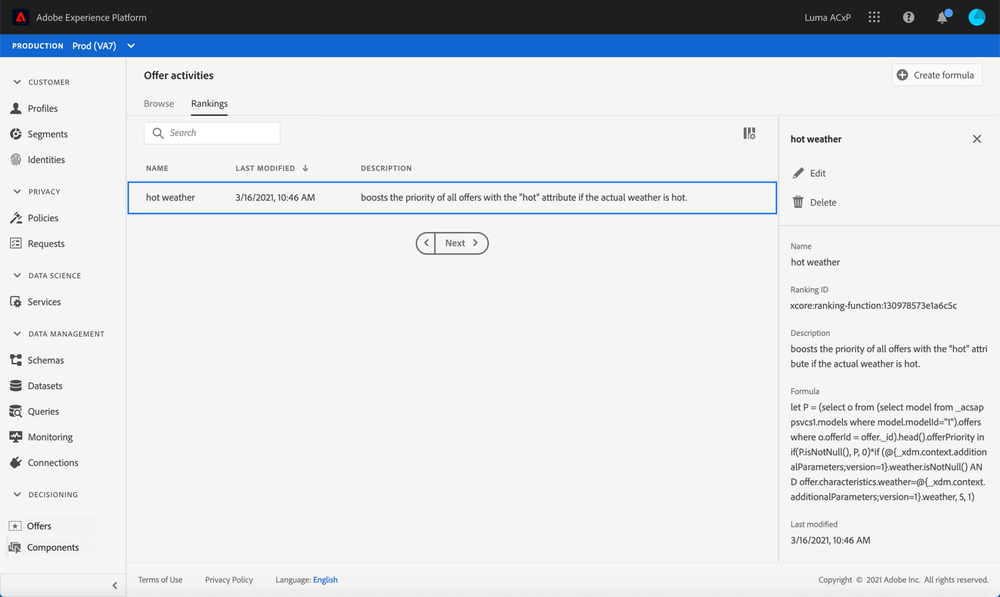

# Create ranking strategies {#create-ranking-strategies}

## About AI ranking

>[!NOTE]
>
>This feature is not enabled by default. To be able to use it, reach out to your Adobe contact.

## Creating a ranking strategy

1. Go to Components and select AI rankings tab.
All the AI rankings created so far are listed.

1. Click the Create strategy button.

1. Fill in the following fields:

    * Name: unique name that the marketer must provide

    * Model type: currently only Auto-optimization is supported as model type. (More will be supported in the future so the drop-down list will be enabled.)

    * Optimization metric
    This option enables marketers to choose how machine learn model should be built and trained: based on offers displayed, offers clicked in email, and/or offers clicked on the web. (You can choose all of them.)
    All selected impression and/or conversion events (offer clicks via email or web) will be captured using the Web SDK or the Mobile SDK that has been provided.
	
        * Impression: All impression events (that are in this case all offers displayed) will be automatically captured by the Web SDK or the Mobile SDK.
        * Conversion: Offer clicks are auto-tracked by the Web SDK

    * Dataset ID: You also need to provide a dataset where conversion events are collected. Select the dataset from the drop-down list. This dataset needs to be associated with a schema that must have the "Proposition Interactions"  field group (previously known as mixin) associated with it.
    
    >[!NOTE]
    >
    >Only the datasets created from schemas associated with the "Experience Event - Proposition Interactions" mixin (field group) are displayed in the drop-down list.

Save and activate the ranking strategy.

## Creating a dataset to collect events

First you need to create a schema:
1. Go to Schemas (under Data Management), select the Browse tab and click Create schema.

    

1. Choose XDM ExperienceEvent.

    For more on XDM schemas and fields groups, see the XDM System overview documentation: https://experienceleague.adobe.com/docs/experience-platform/xdm/home.html?lang=en

1. In the Search field, type proposition interaction and select Experience Event - Proposition Interactions field group.

1. lick Add field groups.

1. Type a name and save the schema. (How do you edit the fields in this new schema? Examples?)

    For more on building schemas, see Basics of schema composition: https://experienceleague.adobe.com/docs/experience-platform/xdm/schema/composition.html?lang=en#understanding-schemas

You're now ready to create a dataset using this schema:

1. Go to Datasets(under Data Management).
1. Click Create dataset, then select Create dataset from schema.
1. Select the schema you just created from the list.
1. Click Next.
1. Give a unique name to the Dataset in the Name field and click Finish.

## Using a ranking strategy

To use the ranking strategy you created:

Once a ranking formula has been created, you can assign it to a placement in a decision (previously known as offer activity). For more on this, see [Configure offers selection in decisions](../offer-activities/configure-offer-selection.md).

1. Create a decision.
1. Add a placement.
1. Add a collection.
1. Choose to rank offers by AI ranking (select it from the drop-down list).
1. Click Add ranking.
1. Select the ranking strategy that you created. All the details of the ranking strategy are displayed.
1. Click Next to confirm.
1. Save your decision.

It is now ready to be used in a decision to xxx (see [Configure offers selection in decisions](../offer-activities/configure-offer-selection.md)).

