# AI rankings {#ai-rankings}

## Get started with AI rankings

Offer Decisioning allows you to use an trained model system that ranks offers to display for a given profile.

This feature enables you to create different **ranking strategies** based on your business goals. Using these different goal-based strategies in a decision (formerly known as offer activity), the trained model system will help you understand how the different ranking strategies are impacting your goals.

For example, you can select a ranking strategy for the email channel and another one for the push channel. For each channel, the trained model system will leverage profile attributes, context data and offer attributes to determine which offer should be presented first for a given placement, rather than taking into account the offers’ priority scores or a [ranking formula](create-ranking-formulas.md).

<!--It has access to the Profile, Context and Offer data and returns the list of Offer IDs ranked for the given profile.
It calls the selected model type passing in a list of offers, each with attributes, to get a ranking back comparing those models.-->

>[!NOTE]
>
>This feature is not enabled by default. To be able to use it, reach out to your Adobe contact.

Once a ranking strategy has been created, assign it to a placement in a decision. Learn more in [Configure offers selection in decisions](../offer-activities/configure-offer-selection.md).

## Create a ranking strategy {#create-ranking-strategy}

To create a ranking strategy, follow the steps below:

1. Access the **[!UICONTROL Components]** menu, then select the **[!UICONTROL AI rankings]** tab.

    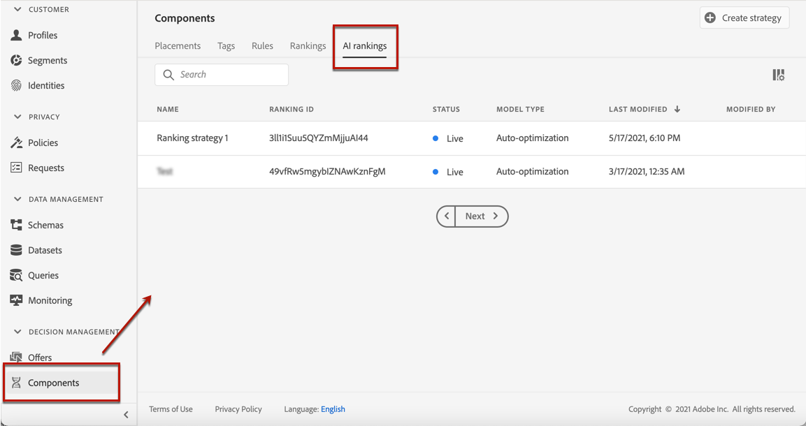

    All the ranking strategies created so far are listed.

1. Click the **[!UICONTROL Create strategy]** button.

1. Fill in the following fields:

    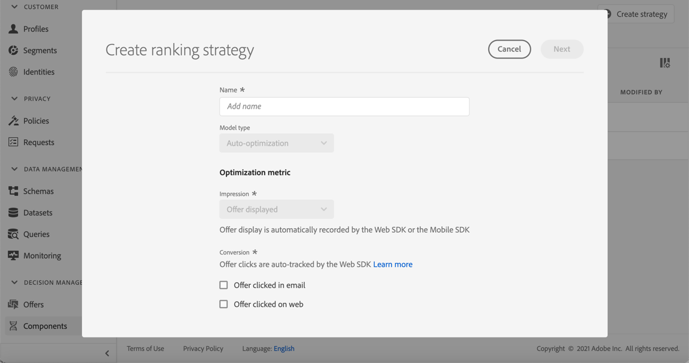

    * **[!UICONTROL Name]**: Unique name that you must provide.

    * **[!UICONTROL Model type]**: Currently the only supported model type is **[!UICONTROL Auto-optimization]**.<!--More will be supported in the future so the drop-down list will be enabled.-->

    * **[!UICONTROL Optimization metric]**:
    
        This option enables marketers to choose how the machine-learn model should be built and trained: based on offers displayed, offers clicked in email, and/or offers clicked on the web.

        >[!NOTE]
        >
        >You can select all metric types if needed.

        There are two types of optimization metrics:
        * **[!UICONTROL Impression]**: Currently impression events correspond to all offers that are displayed.
        * **[!UICONTROL Conversion]**: Conversion events correspond to all offers that result in clicks via email or web.

        All selected impression events and/or conversion events will be automatically captured using the Web SDK or the Mobile SDK that has been provided. Learn more on this in [Adobe Experience Platform Web SDK overview](https://experienceleague.adobe.com/docs/experience-platform/edge/home.html?lang=en).

    * **[!UICONTROL Dataset ID]**: For conversion, you need to provide a dataset where events are collected by selecting it from the drop-down list. Learn how to create such dataset in [this section](#create-dataset). <!--This dataset needs to be associated with a schema that must have the **[!UICONTROL Proposition Interactions]** field group (previously known as mixin) associated with it.-->

    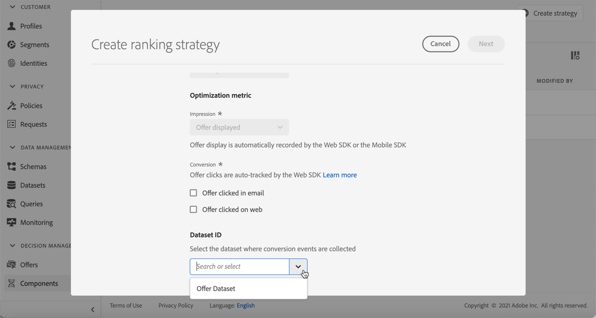
    
    >[!CAUTION]
    >
    >Only the datasets created from schemas associated with the **[!UICONTROL Experience Event - Proposition Interactions]** field group (previously known as mixin) are displayed in the drop-down list.

1. Save and activate the ranking strategy.

    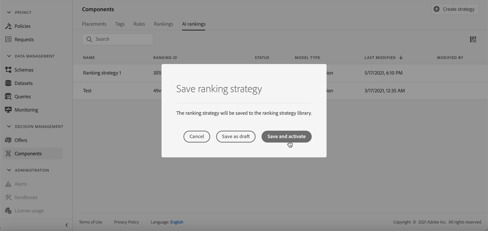

It is now ready to be used in a decision to rank eligible offers for a placement. Learn more in [this section](../offer-activities/configure-offer-selection.md#use-ranking-strategy).<!--TBC?-->

## Create a dataset to collect events {#create-dataset}

You need to create a dataset where conversion events will be collected. Start by creating the schema that will be used in your dataset:

1. From the **[!UICONTROL Data Management]** menu, select **[!UICONTROL Schema]**, go to the **[!UICONTROL Browse]** tab and click **[!UICONTROL Create schema]**.

    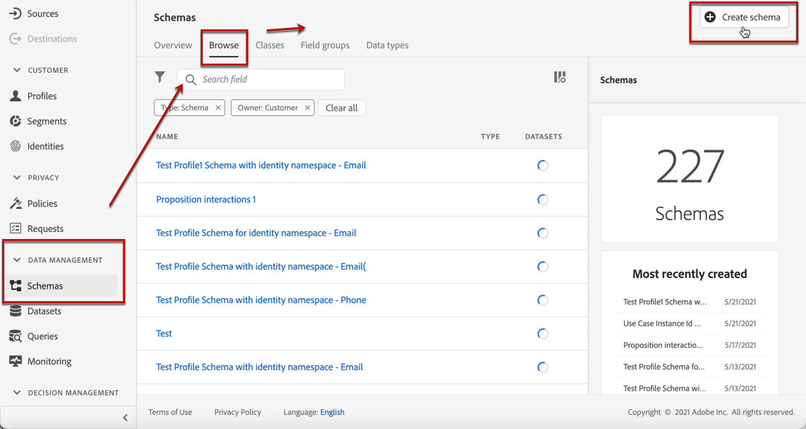

1. Choose **[!UICONTROL XDM ExperienceEvent]**.

    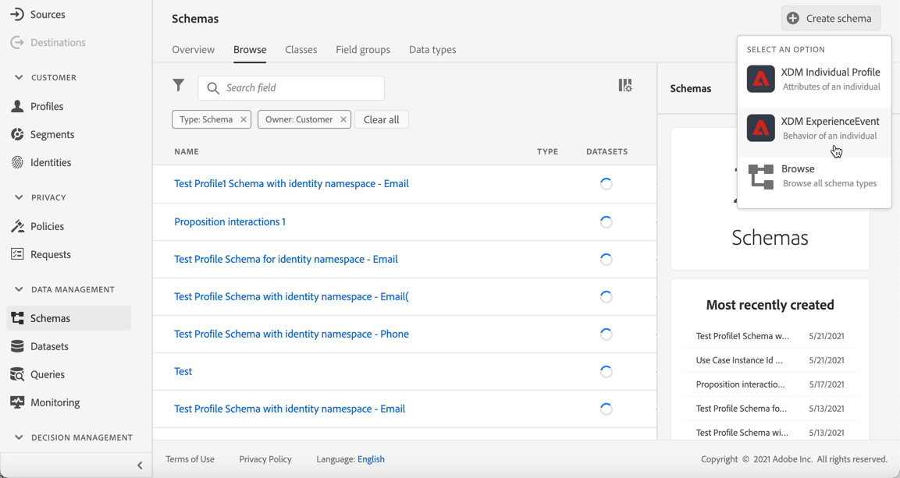

    >[!NOTE]
    >
    >    Learn more on XDM schemas and fields groups in the [XDM System overview documentation](https://experienceleague.adobe.com/docs/experience-platform/xdm/home.html?lang=en).

1. In the **[!UICONTROL Search]** field, type "proposition interaction" and select the **[!UICONTROL Experience Event - Proposition Interactions]** field group.

    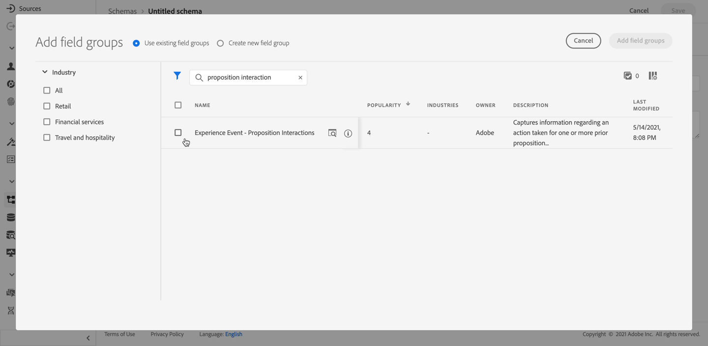

    >[!CAUTION]
    >
    >    The schema that will be used in your dataset must have the **[!UICONTROL Experience Event - Proposition Interactions]** field group associated with it. Otherwise you will not be able to use it in your ranking strategy.

1. Click **[!UICONTROL Add field groups]**.

    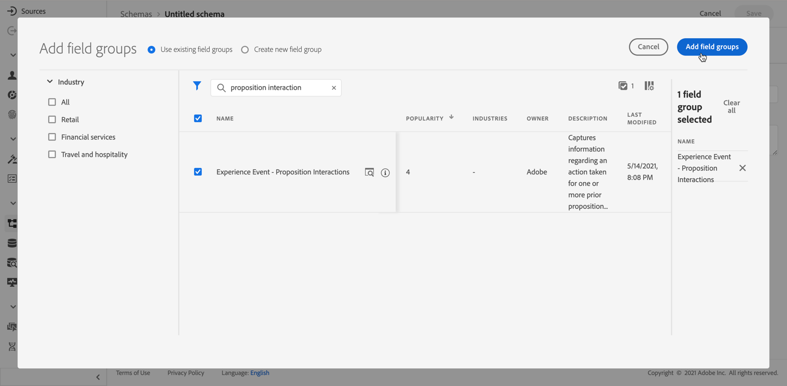

    >[!NOTE]
    >Field group was previously known as mixin.
    >    

1. Type a name and save the schema.<!--How do you edit the fields in this new schema? Examples?-->

>[!NOTE]
>
>    Learn more on building schemas in [Basics of schema composition](https://experienceleague.adobe.com/docs/experience-platform/xdm/schema/composition.html?lang=en#understanding-schemas).

You're now ready to create a dataset using this schema. To do this, follow the steps below:

1. From the **[!UICONTROL Data Management]** menu, select **[!UICONTROL Datasets]**, go to the **[!UICONTROL Browse]** tab and click **[!UICONTROL Create dataset]**.

    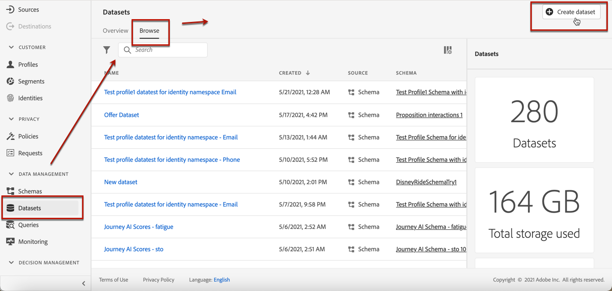

1. Select **[!UICONTROL Create dataset from schema]**.

    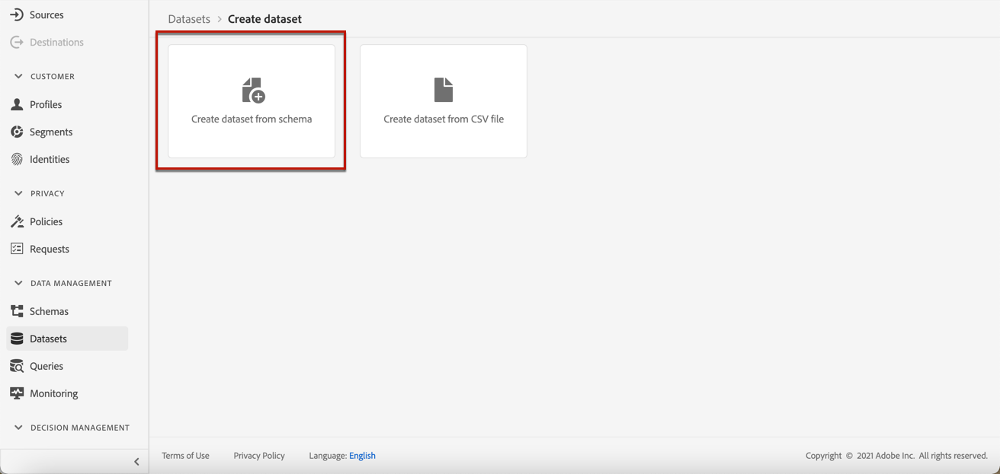
    
1. Select the schema you just created from the list.

    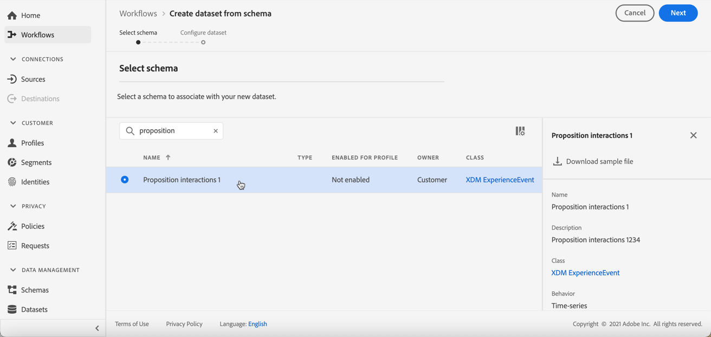

1. Click **[!UICONTROL Next]**.

1. Provide a unique name for the dataset in the **[!UICONTROL Name]** field and click **[!UICONTROL Finish]**.

    

The dataset is now ready to be selected to collect conversion events when [creating a ranking strategy](#create-ranking-strategy).

<!--## Using a ranking strategy {#using-ranking}

To use the ranking strategy you created above, follow the steps below:

Once a ranking strategy has been created, you can assign it to a placement in a decision (previously known as offer activity). For more on this, see [Configure offers selection in decisions](../offer-activities/configure-offer-selection.md).

1. Create a decision.
1. Add a placement.
1. Add a collection.
1. Choose to rank offers by AI ranking (select it from the drop-down list).
1. Click Add ranking.
1. Select the ranking strategy that you created. All the details of the ranking strategy are displayed.
1. Click Next to confirm.
1. Save your decision.

It is now ready to be used in a decision to rank eligible offers for a placement (see [Configure offers selection in decisions](../offer-activities/configure-offer-selection.md)).-->

