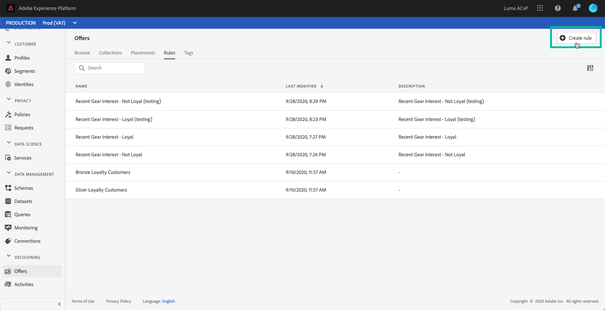

# Creating decision rules {#creating-decision-rules}

You can create offer decision rules based on data available in Adobe Experience Platform. Decision rules determine to whom an offer can be shown.

For example, you can specify that you only want a 'Women's Winter Clothing Offer' to be shown when (Gender = 'Female') and (Region = 'Northeast').

To create a decision rule, follow these steps:

1. Select the **[!UICONTROL Decision Rules]** tab, then click **[!UICONTROL Create Decision Rule]**.

    

1. Name your rule, then define the conditions corresponding to your needs, using the Unified Segment Builder.

    >[!NOTE]
    >
    >The Unified Segment Builder to create decision rules presents some specificities compared to the one for audiences. The **[!UICONTROL Segments]** tab, for example is not available for use. However, the global process described in the [Unified Segment Builder documentation](https://docs.adobe.com/content/help/en/experience-platform/segmentation/ui/segment-builder.html) is still valid to build offers decisions rules.

    

1. Click Save.
