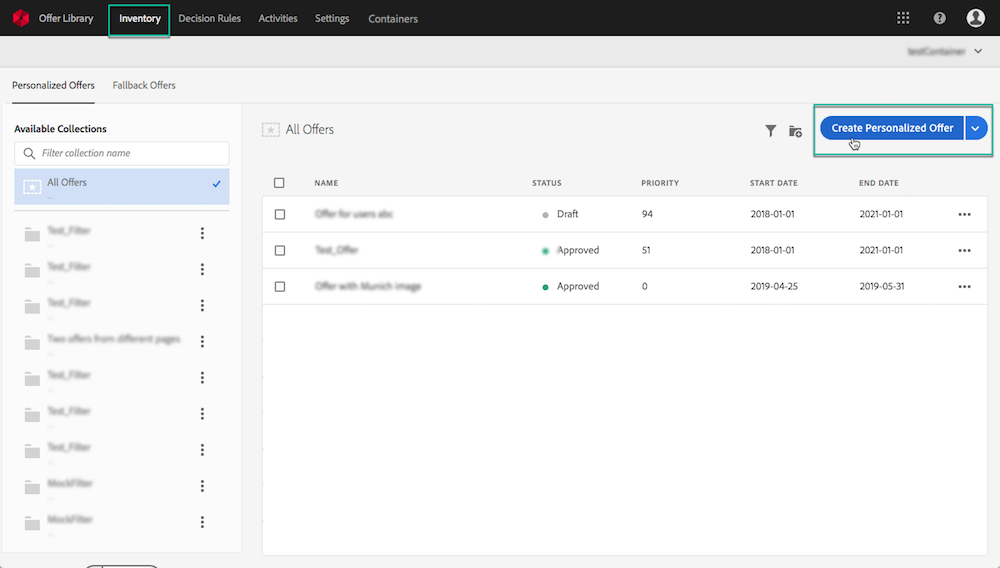
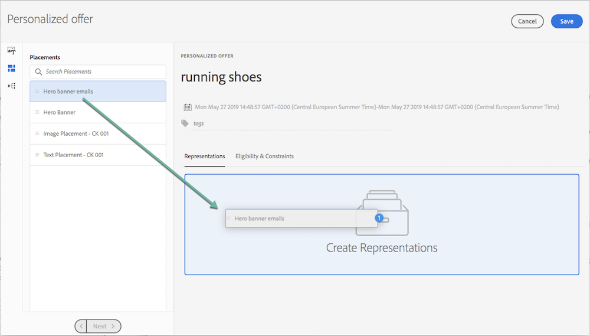
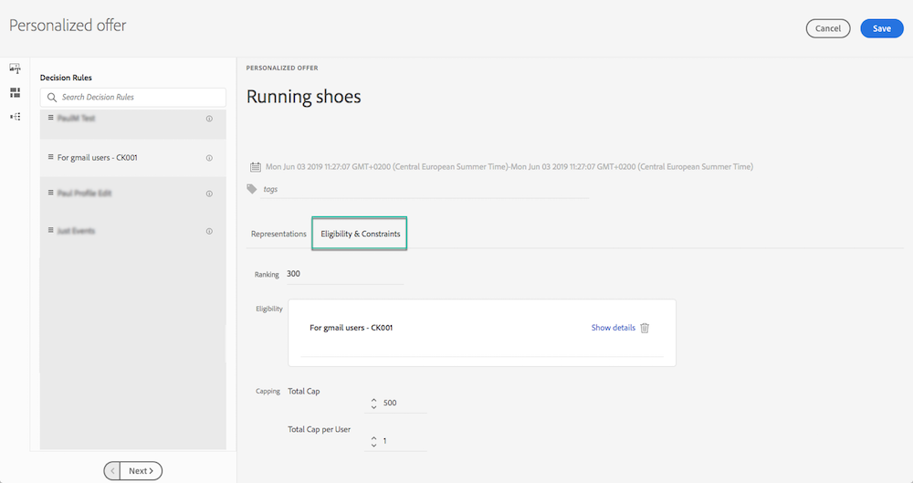

# Creating personalized offers {#creating-personalized-offers}

Before creating an offer, make sure that you created:

* A **placement** in which the offer will be displayed. See 
* A **decision rule** that will define the condition under which the offer will be presented. See .
* One or several **tags** that you want to associate to the offer. See .

Each offer is made up of:

* One or several **Offers Representations**. An offer can be displayed at different places in a message: in a top banner with an image, in text format in a paragraph, and so on.

    The more representations an offer has, the more opportunity exists to use the offer in different placement contexts.

* **Eligibility and Constraints parameters**. These are rules that will define the conditions under which an offer will be displayed.

To create an Offer, follow these steps:

1. Select the **[!UICONTROL Inventory]** tab, then click the **[!UICONTROL Create Personalized Offer]** button.

    

1. Define the offer's name, then create an offer representation. To do this, drag and drop the placement that will contain the offer into the **[!UICONTROL Create Representations]** area.

    

1. Add content to the offer representation. To this, click the **[!UICONTROL xxx]** icon from the left pane to display the Experience Cloud Library.

1. Drag and drop the desired content (text, image or HTML) into the offer representation area.

    >[!NOTE]
    >
    >Make sure that the content you are selecting corresponds to the content type defined when creating the placement (image, HTML, or text). Otherwise, the offer representation will display in red.

    

    You can also insert text-type content without using the Experience Cloud Library. To do this, click the **[!UICONTROL xxx]** button, then select **[!UICONTROL Add Text]**.

1. In the **[!UICONTROL Text]** field, type the text that will display in the offer.

    >[!NOTE]
    >
    >You will be able to customize the text layout in Campaign once it is inserted into an offer activity.

    

1. For image and text-type content, define the URL to associate with them in the **[!UICONTROL URL]** field.

    >[!NOTE]
    >
    >For now, the **[!UICONTROL Language]** field is not part of offers management use case and should not be used.

1. Repeat these steps to create as many offer representations as needed.

1. Define the offer's eligibility rules and constraints. To do this, select the **[!UICONTROL Eligibility and constraints]** tab, then configure the properties according to your needs:

    * **[!UICONTROL Ranking]**: the offer's priority compared to other offers. The highest an offer's ranking will be, the highest its priority will be compared to other offers.
    * **[!UICONTROL Eligibility]**: associate an existing decision rule to the offer that will define when to present it (for example to women over 30 only, profiles living in London, and so on.) To do this, drag and drop a decision rule from the left pane.
    * **[!UICONTROL Capping]**: the number of times the offer will be presented in total and per user.

        >[!NOTE]
        >
        >The number of times an offer is proposed is calculated at email preparation time.
        >
        >For example, if you prepare an email with a number of offers, those numbers count towards your max cap regardless of whether or not the email is sent.
        >
        >If an email delivery is deleted or if the preparation is done again before being sent, the capping value for the offer is automatically updated.

    

    In the example above:

    * The offer ranking is set to "300", meaning the offer will be presented before offers with a capping value between 1 and 299, and after the ones with a capping value of at least 301.
    * The offer will be considered for users with a Gmail email address only.
    * The offer will be presented a maximum of 500 times, and only once per user.

1. You can associate one or several existing tag(s) to the offer, allowing you to search and organize the Offer Library more easily. To do this, type the first letters of the desired tag then select it. You can also visualize the entire list of tags by pressing the down arrow key.

    

1. Click **[!UICONTROL Save]**, then **[!UICONTROL Approve and Save]** if the offer is ready to be used. Otherwise, click **[!UICONTROL Save Draft]** to save and finalize it later on.

    
