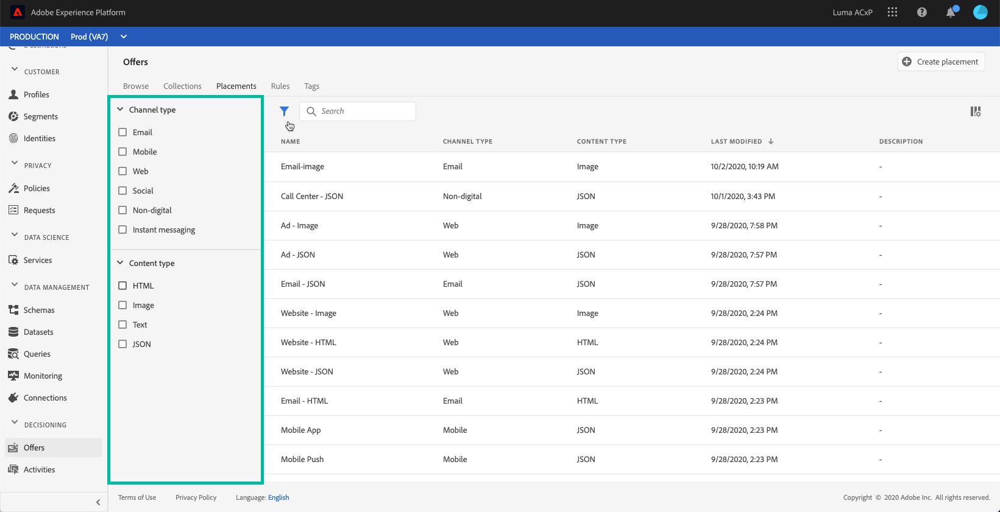
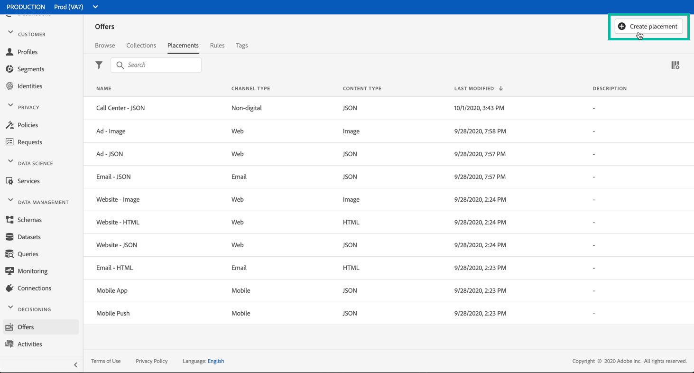
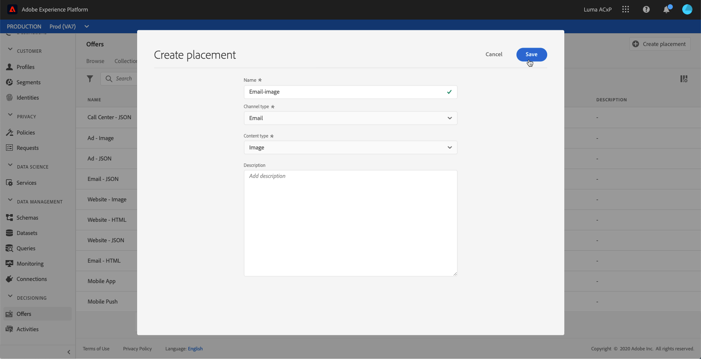
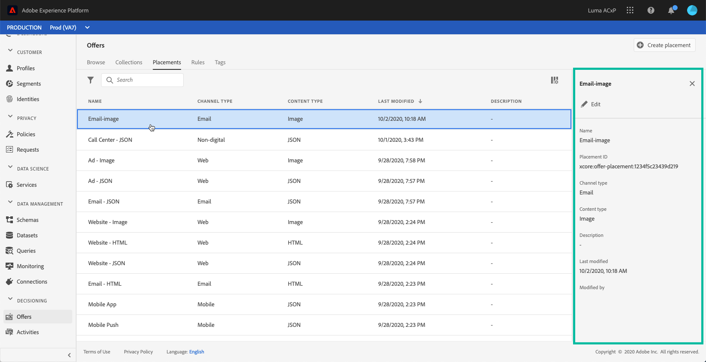

# Creating placements {#creating-placements}

A placement helps ensure that the right offer content shows up in the right location within your message. When you add content to an offer, you will be asked to select a placement in which that content can be shown.

In the example below, there are three placements, corresponding to different types of content (image, text, HTML).

The list of placements is accessible in the **[!UICONTROL Placements]** tab. Filters are available to help you retrieve placements according to a specific channel or content.

To create a placement, follow these steps:

1. Go to the **[!UICONTROL Placements]** tab, then click **[!UICONTROL Create placement]**.

    

1. Define the placement's properties:

    * **[!UICONTROL Name]**: The name of the placement. Make sure to define a meaningful name to retrieve it more easily.
    * **[!UICONTROL Channel type]**: the channel for which the placement will be used.
    * **[!UICONTROL Content type]**: the type of content that the placement will be allowed to display: Text, HTML or Image Link.
    * **[!UICONTROL Description]**: A description of the placement (optional).

    

1. Click **[!UICONTROL Save]** to confirm.

1. Once the placement is created, it displays in the placements list. You can select it to display its properties and edit it. <!-- no suppression?>

    

